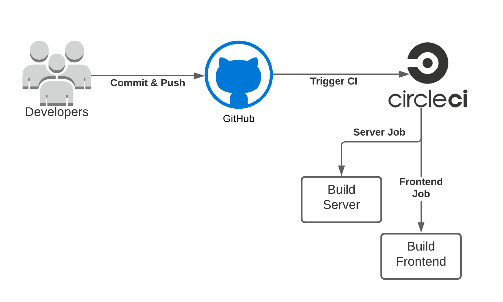

## Udagram Pipeline

### Continuous Integration
#### GitHub
The developers commit and push their code to the GitHub repository which is linked to the CircleCI platform.
GitHub triggers the CircleCI platform when code is pushed to the repository.

#### CircleCI
CircleCI reads the `.circleci/config.yml` file which tells the service what has to be done. In the case of Udagram,
there are 2 jobs (frontend & server) to be run by CircleCI.
- **Frontend**: Runs the `build` script given in the `package.json` file. Then uses AWS CLI to upload assets to S3.
- **Server**: Runs the `build` script, exports all environment variables from CircleCI configuration to a `.env` file,
  then runs the `archive` script. Then uses AWS CLI to upload archive to S3.
